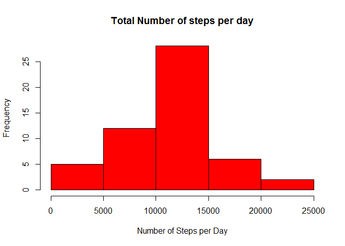
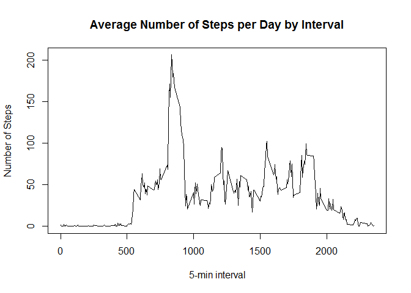
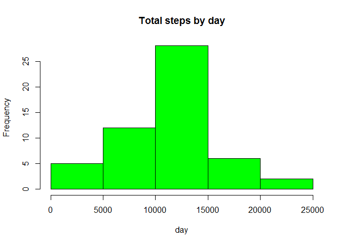
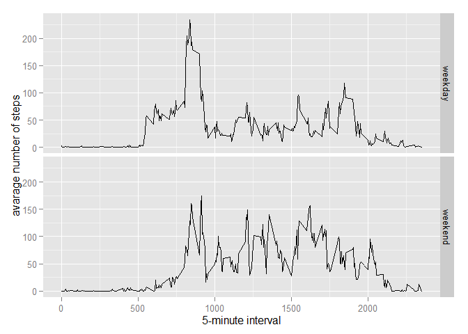

# Reproducible Research: Peer Assessment 1


#### Required Packages

library(ggplot2)
library(scales)
library(Hmisc)

## 1. Loading and preprocessing the data

#### read the data from csv file

#### Process/transform the data (if necessary) into a format suitable for your analysis


```r
activity <- read.csv("C:/Users/ram_local/Documents/my_assignments/activity.csv", header = TRUE, sep = ",",
                  colClasses=c("numeric", "character", "numeric"))
activity <- na.omit(activity)
activity$date <- as.Date(activity$date, "%Y-%m-%d")
```

## 2. What is mean total number of steps taken per day

#### Calculate the total number of steps taken per day


```r
totalSteps <- aggregate(steps ~ date, data = activity, sum, na.rm = TRUE)
```

#### Make a histogram of the total number of steps taken each day
 

```r
hist(totalSteps$steps, main = "Total Number of steps per day", xlab = "Number of Steps per Day", col = "red")
```

 

#### Calculate and report the mean and median of the total number of steps taken per day


```r
totalStepsMean <- mean(totalSteps$steps, na.rm=TRUE)
totalStepsMedian <- median(totalSteps$steps, na.rm= TRUE)
View(totalStepsMean)
print(sprintf("Mean total steps taken per day: %f ", totalStepsMean))
```

```
## [1] "Mean total steps taken per day: 10766.188679 "
```

```r
print(sprintf("Median total steps taken per day: %f ", totalStepsMedian))
```

```
## [1] "Median total steps taken per day: 10765.000000 "
```

## 3.What is the average daily activity pattern

#### Make a time series plot (i.e. type = "l") of the 5-minute interval (x-axis) and the average number of steps taken,        averaged across all days (y-axis)
 


```r
stepsByInterval <- tapply(activity$steps, activity$interval, mean, na.rm = TRUE)

plot(row.names(stepsByInterval), stepsByInterval, type = "l", xlab = "5-min interval", 
    ylab = "Number of Steps", main = "Average Number of Steps per Day by Interval") 
```

 

#### Which 5-minute interval, on average across all the days in the dataset, contains the maximum number of steps


```r
max_interval <- which.max(stepsByInterval)
print(names(max_interval))
```

```
## [1] "835"
```


## 4. Imputing missing values

#### Calculate and report the total number of missing values in the dataset (i.e. the total number of rows with NAs)


```r
activity_NA <- sum(is.na(activity))
```

#### Devise a strategy for filling in all of the missing values in the dataset
#### Create a new dataset that is equal to the original dataset but with the missing data filled in


```r
library(Hmisc)
```

```
## Loading required package: grid
## Loading required package: lattice
## Loading required package: survival
## Loading required package: Formula
## Loading required package: ggplot2
## 
## Attaching package: 'Hmisc'
## 
## The following objects are masked from 'package:base':
## 
##     format.pval, round.POSIXt, trunc.POSIXt, units
```

```r
activityDataImputed <- activity
activityDataImputed$steps <- impute(activity$steps, fun=mean)
```

#### Make a histogram of the total number of steps taken each day 


```r
library(Hmisc)
stepsByDayImputed <- tapply(activityDataImputed$steps, activityDataImputed$date, sum)
hist(stepsByDayImputed, main = "Total steps by day", xlab = "day", col = "green")
```

 


#### Calculate and report the mean and median total number of steps taken per day


```r
StepsTotal2 <- aggregate(steps ~ date, data = activity, sum, na.rm = TRUE)
mean(StepsTotal2$steps)
```

```
## [1] 10766.19
```

```r
median(StepsTotal2$steps)
```

```
## [1] 10765
```

## 5.Are there differences in activity patterns between weekdays and weekends

#### Create a new factor variable in the dataset with two levels - "weekday" and "weekend" indicating whether a given date is a weekday or weekend day


```r
activityDataImputed$dateType <-  ifelse(as.POSIXlt(activityDataImputed$date)$wday %in% c(0,6), 'weekend', 'weekday')
```


#### Make a panel plot containing a time series plot (i.e. type = "l") of the 5-minute interval (x-axis) and the average number of steps taken, averaged across all weekday days or weekend days (y-axis)


```r
library(ggplot2)
averagedActivityDataImputed <- aggregate(steps ~ interval + dateType, data=activityDataImputed, mean)

ggplot(averagedActivityDataImputed, aes(interval, steps)) + 
        geom_line() + 
        facet_grid(dateType ~ .) +
        xlab("5-minute interval") + 
        ylab("avarage number of steps")
```

 

